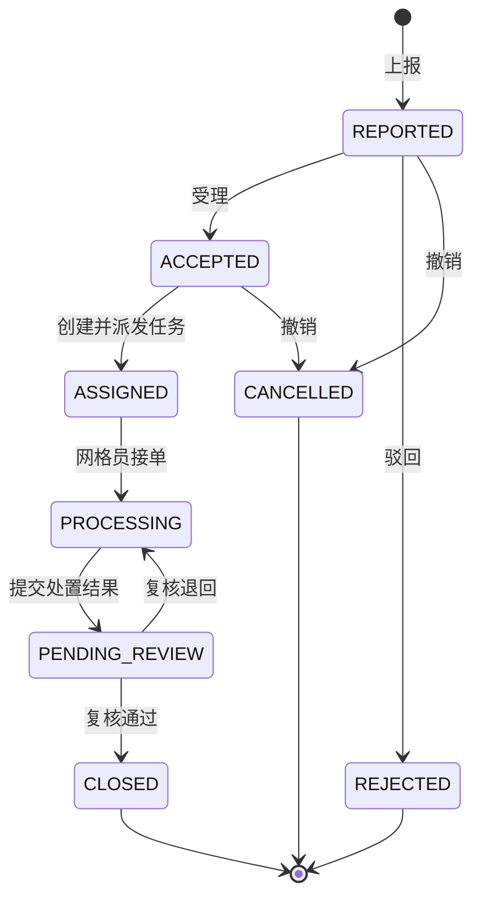
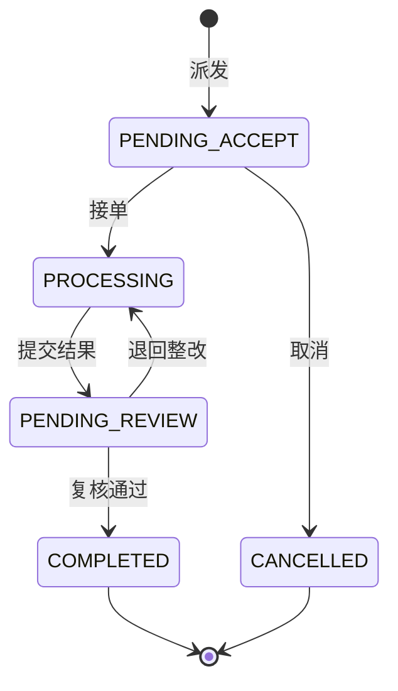
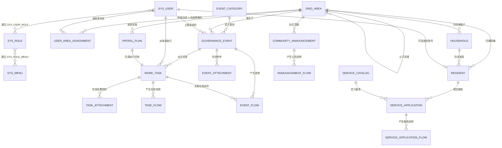

# 功能与系统设计基线

> 版本：0.6
> 日期：2026-08-19
> 状态：毕业设计首版实施基线

## 1. 建设目标

平台以社区网格为管理单元，把居民档案、网格员责任区、任务派发、矛盾纠纷及其他治理事件统一到一条可追踪的业务链中。

首版必须形成以下闭环：

```text
网格建档
  → 居民归属网格
  → 居民或工作人员上报事件
  → 社区工作人员受理并派发任务
  → 网格员接单和处置
  → 社区工作人员复核
  → 事件办结并保留完整流转记录
```

## 2. 角色边界

| 角色 | 主要职责 | 数据范围 |
|---|---|---|
| 系统管理员 | 管理驾驶舱、账号权限、服务目录、审计、系统健康和全局业务查看 | 全部数据 |
| 社区工作人员 | 今日待办、网格居民、事件任务、社区公告、服务受理、巡查计划和报表 | 所属社区 |
| 网格员 | 本人巡查、现场上报、任务处置、责任地图和工作记录 | 已分配网格；任务与巡查再限定本人 |
| 居民 | 本人事项、档案、公告、服务申请/撤回/评价 | 本人数据 |

系统采用四类固定核心角色；居民通过实名匹配与管理员审核后进入本人服务台，不能访问后台管理功能。

## 3. 功能范围

### 3.1 登录与权限

- `AUTH-01` 用户名和密码登录、退出。
- `AUTH-02` BCrypt 密码校验，禁止明文密码入库或返回前端。
- `AUTH-03` 后端按角色和数据范围执行鉴权，前端菜单隐藏不能替代后端鉴权。
- `AUTH-04` 在固定角色码、菜单码、路由和权限码边界内管理用户、角色展示、菜单展示和角色菜单关系，禁止创建任意高权限角色或改写核心编码。
- `AUTH-05` 用户状态、角色、角色权限或菜单状态改变后，使相关账号旧会话在下一次请求立即失效。
- `AUTH-06` 登录后由后端返回当前用户可访问、状态为启用且已获授权的 `MENU` 导航项及其动态元数据；前端以该列表渲染导航，但不动态注册路由，只把本地已注册路由作为白名单。服务端成功返回空列表时首页进入 `/forbidden`；仅导航请求失败时才退回权限过滤后的本地首项。角色菜单或菜单状态变化后，旧会话失效，重新登录得到的新导航必须即时反映变化。
- `AUTH-07` 用户可验证原密码后修改本人密码；系统管理员可输入一次性临时密码执行受控重置。两种操作均递增安全版本使旧会话失效；管理员重置后，用户完成强制改密前只能访问当前用户、CSRF、改密和退出接口。
- `AUTH-08` 四类角色使用同一登录入口并获得按开题报告收敛的 11/6/5/4 个差异化服务端导航，首页分别为 `/admin/home`、`/community/home`、`/grid/home`、`/resident/home`。网格员的底层范围只读权限不形成通用管理菜单；直接访问未授权业务页进入无权页。

### 3.2 网格区域

- `GRID-01` 建立社区和网格两级区域。
- `GRID-02` 维护网格编码、名称、地址说明、中心点和可选 GeoJSON 边界。
- `GRID-03` 为社区分配一个或多个社区工作人员、为网格分配一个或多个网格员，并在每个区域的有效分配中标记且仅标记一名主负责人。
- `GRID-04` 停用网格前检查是否仍有有效居民、未办结事件或进行中任务。
- `GRID-05` 按社区、状态和关键词分页查询网格。
- `GRID-06` 空间地图只绘制数据库中经纬度完整且在合法范围内的网格中心点；缺失或无效坐标的网格必须同屏进入待定位清单，不得生成模拟坐标或模拟边界。

### 3.3 居民档案

- `RES-01` 维护家庭户和居民档案。
- `RES-02` 居民必须归属一个有效网格，家庭户可选。
- `RES-03` 支持姓名、居民编号和地址普通检索；身份证号、手机号使用独立 POST 请求完成精确指纹检索，敏感值不得进入 URL。
- `RES-04` 身份证号、手机号只对授权角色在填写业务用途后临时解密显示，其余场景脱敏；前端明文展示 60 秒后自动清空。
- `RES-05` 居民迁出、死亡或归档时保留历史，不物理删除。
- `RES-06` 支持独居老人、低保、残障等重点人群标签。
- `RES-07` 敏感字段检索与明文查看必须记录操作人、动作、居民、字段类型、用途、结果数和时间，不记录明文或指纹。
- `RES-08` 系统管理员和所属社区工作人员可按分页查看敏感字段访问审计；结果只返回审计元数据，并按历史记录的 `scope_grid_id` 隔离。受限账号只能查看当前范围内的记录，或本人产生的空范围记录；V6 遗留空范围记录保持空范围，不能用居民当前网格回填或反推历史范围；不得返回明文、密文或等值指纹。
- `RES-09` 居民本人可在服务台维护联系地址和新手机号，不能修改姓名、身份证、所属网格、家庭户、重点标签、户主标记或档案状态。新手机号继续加密保存、生成精确检索指纹并只返回脱敏值；更新携带 `version` 并仅作用于当前账号绑定的有效档案。

### 3.4 治理事件

- `EVT-01` 上报矛盾纠纷、环境卫生、公共设施、安全隐患、民生诉求等事件。
- `EVT-02` 记录事件来源、网格、地点、描述、严重程度、上报人和附件。
- `EVT-03` 系统生成唯一事件编号。
- `EVT-04` 社区工作人员受理、驳回或派发事件。
- `EVT-05` 每次状态变化必须新增 `event_flow`，禁止覆盖历史记录。
- `EVT-06` 事件办结后保留处置结果、复核人和办结时间。
- `EVT-07` 系统管理员维护事件类别的编码、名称、说明、排序和启停状态；类别更新使用乐观锁，仍被非终结事件引用的类别不得停用，已终结历史事件不永久锁死类别。
- `EVT-08` 事件附件支持列表、上传、授权下载和删除。上传接口可带 UUID `requestToken`；前端对每个文件必传稳定令牌，重试同一请求不得新增附件。删除事务提交后再清理物理文件；失败或进程中断时保留待清理标记，由定时扫描重试。后台删除必须同时校验权限、网格数据范围、上传人和事件状态；居民只能在本人上报且仍为 `REPORTED` 的事件上操作本人附件，并通过居民服务台专用接口访问内容。

### 3.5 网格任务

- `TASK-01` 社区工作人员可创建日常巡查任务或从事件派生处置任务。
- `TASK-02` 任务包含责任网格、执行人、优先级、期限和任务状态。
- `TASK-03` 网格员只能接收和处理本人责任范围内的任务。
- `TASK-04` 网格员提交处置结果后进入待复核，不能自行把任务标记为最终完成。
- `TASK-05` 复核不通过时退回处理中并记录原因。
- `TASK-06` 每次任务状态变化必须新增 `task_flow`，任务与事件的状态更新在同一事务中完成。
- `TASK-07` 任务附件支持上传、列表、下载和删除；上传重试使用每个文件稳定的 UUID `requestToken`，重复请求返回原附件。软删提交后异步清理物理文件，待清理记录在失败或崩溃后由扫描任务重试。提交复核时的 `attachmentIds` 必须全部属于当前任务。跨任务、跨网格、非执行人、终态任务或不满足状态约束的附件操作必须由服务端拒绝。

### 3.6 统计大屏

- `DASH-01` 网格数、居民数、重点人群数。
- `DASH-02` 待受理、处理中、待复核、已办结事件数；其中“处理中”必须聚合 `ACCEPTED`、`ASSIGNED` 和 `PROCESSING` 三种事件状态。
- `DASH-03` 返回 `gridEventStats`：`{ gridId, gridCode, gridName, eventCount, completedWithDeadlineCount, onTimeClosedCount, onTimeCompletionRate }`。分母仅统计存在 `due_at` 且已经完成的事件派生任务，未完成到期任务和无期限任务不进入该按期办结率分母。`onTimeCompletionRate` 为 `0..100` 的百分数数值，`1` 表示 `1%`；无分母时返回 `0`。
- `DASH-04` 返回 `categoryStats`：至少包含 `{ categoryId, categoryName, eventCount, percentage }`，其中 `percentage` 为 `0..100` 的百分数数值，`1` 表示 `1%`，无事件总数时返回 `0`；并返回按 `reportedAt`、`id` 倒序且最多 10 条的 `recentEvents`：`{ id, eventNo, title, categoryName, gridName, status, severity, reportedAt }`。

### 3.7 四角色工作台

- `WORKBENCH-01` 四个角色首页只呈现开题范围内的账号/权限、网格/居民、治理事件、任务和本人事项；网格员统计按执行人过滤，居民统计按本人过滤。
- `WORKBENCH-02` 管理员、社区、网格员和居民的可见动态入口精确为 11/6/5/4，每个入口必须映射开题报告中的真实业务、API、权限和数据库数据。

### 3.8 保留扩展：公告（V12 默认隐藏）
- `NOTICE-01` 公告支持全局/社区范围、草稿编辑、发布和撤回；非管理角色只能读取已发布且范围可见的公告。
- `NOTICE-02` 公告内容和状态更新使用乐观锁，每次动作新增 `announcement_flow`。

### 3.9 保留扩展：社区服务申请（V12 默认隐藏）

- `SERVICE-01` 管理员维护启停服务目录；居民只能从启用目录提交本人申请。
- `SERVICE-02` 申请按 `SUBMITTED → ACCEPTED → PROCESSING → COMPLETED` 流转，待受理申请可驳回或由本人撤回，已完成申请只能由本人评分一次。
- `SERVICE-03` 居民查询始终按申请账号本人，社区处理按网格范围，处理人受理后只有本人可继续处理；每步写入 `service_application_flow`。
- `SERVICE-04` 提交支持本人 + UUID 请求令牌幂等，不复制手机号、身份证等敏感数据。

### 3.10 保留扩展：巡查计划（V12 默认隐藏）

- `PATROL-01` 社区人员为责任网格员创建单次巡查计划，创建时同事务生成一条 `ROUTINE_INSPECTION` 待接单任务。
- `PATROL-02` 网格员通过既有任务状态机接单、提交结果，社区复核通过时同事务把巡查计划标记为完成。
- `PATROL-03` 未接单计划取消时计划、任务和流转记录同事务更新；一项计划最多关联一项任务。

### 3.11 操作审计

- `AUDIT-01` 事件、任务、敏感访问、公告和服务申请继续使用各自不可覆盖的业务流转记录。
- `AUDIT-02` 所有授权附件下载，以及用户、角色、菜单、事件类别、网格责任和密码变更等关键管理请求，记录操作人、时间、动作、业务对象路径、HTTP 状态和成功/失败结果。
- `AUDIT-03` 系统管理员可按模块、操作人、业务对象、时间范围和结果分页查询统一审计视图；审计记录不得保存密码、证件号、手机号、Session、CSRF Token、密钥或附件内容。

## 4. 权限矩阵

| 操作 | 系统管理员 | 社区工作人员 | 网格员 | 居民 |
|---|---:|---:|---:|---:|
| 用户与角色管理 | 是 | 否 | 否 | 否 |
| 网格维护 | 是 | 是 | 只读责任网格 | 否 |
| 居民档案维护 | 是 | 是 | 只读责任网格 | 只读本人 |
| 居民敏感字段检索与查看 | 是 | 所属社区 | 否 | 否 |
| 居民敏感访问审计查询 | 是 | 所属社区 | 否 | 否 |
| 事件类别维护 | 是 | 否 | 否 | 否 |
| 事件上报 | 是 | 是 | 是 | 是 |
| 事件受理与派发 | 是 | 是 | 否 | 否 |
| 事件附件删除 | 是 | 所属社区 | 责任网格且符合上传/状态约束 | 仅本人 `REPORTED` 事件的本人附件 |
| 任务接单与处置 | 否 | 可代办 | 是 | 否 |
| 任务附件操作 | 是 | 所属社区且符合状态约束 | 本人责任任务且符合状态约束 | 否 |
| 处置复核与办结 | 是 | 是 | 否 | 否 |
| 全局统计 | 是 | 所属社区 | 责任网格 | 否 |
| 公告 | 全局发布/撤回 | 所属社区发布/撤回 | 读取可见公告 | 读取可见公告 |
| 服务申请 | 目录维护、全局只读 | 所属社区受理/处理/办结 | 否 | 本人提交/撤回/评价 |
| 巡查计划 | 全局只读 | 所属社区创建/取消/复核 | 本人执行 | 否 |

说明：网格员的 `grid:read`、`resident:read` 用于事件、任务页面解析责任网格和范围内居民关联，不代表显示独立“网格管理”或“居民档案”菜单，也不授予写入、敏感查看或审计权限。

## 5. 状态机

### 5.1 事件状态



### 5.2 任务状态



### 5.3 事件与任务联动

| 业务动作 | 事件状态 | 任务状态 | 必须写流转记录 |
|---|---|---|---|
| 事件上报 | `REPORTED` | 无 | 是 |
| 受理 | `ACCEPTED` | 无 | 是 |
| 派发 | `ASSIGNED` | `PENDING_ACCEPT` | 是 |
| 网格员接单 | `PROCESSING` | `PROCESSING` | 是 |
| 提交处置 | `PENDING_REVIEW` | `PENDING_REVIEW` | 是 |
| 复核通过 | `CLOSED` | `COMPLETED` | 是 |
| 复核退回 | `PROCESSING` | `PROCESSING` | 是 |

## 6. 核心业务规则

1. 所有编号由后端生成，不接受前端自定义主键或业务编号。
2. 角色权限与网格数据范围均由后端校验。
3. 事件和任务使用 `version` 字段做乐观锁，避免两人同时处理造成覆盖。
4. 派发、接单、提交处置、复核均使用事务；任一步失败，事件、任务和流转记录全部回滚。
5. `event_flow` 和 `task_flow` 只允许新增，不允许修改和删除。
6. 核心业务记录不做物理删除，只允许取消、停用或归档。
7. 附件上传前校验大小、MIME 类型和散列值；上传目录通过配置注入。
8. 居民敏感字段采用应用层加密，另存 SHA-256 哈希用于精确查重和后四位用于脱敏展示。
9. 网格员只能处理已分配到本人或本人责任网格的任务。
10. 办结必须由派发人以外的有权限人员复核，避免自己处置、自己验收。
11. 居民选择家庭户时，居民和家庭户必须属于同一网格。
12. `user_area_assignment` 中，社区工作人员只能绑定 `COMMUNITY`，网格员只能绑定 `GRID`；同一区域、同类职责最多一个有效主负责人。
13. 家庭户、居民、事件和任务的 `grid_id` 必须引用 `GRID` 类型区域，不能直接引用社区节点。
14. 一个事件同一时刻最多存在一个未完成或未取消的任务；历史任务保留，不物理覆盖。
15. 责任区分配结束时保留原记录和 `ended_at`，重新分配新增记录；数据库只限制同一用户、区域和职责最多一条有效分配。
16. 工作人员公开注册只创建待审核停用账号，角色只能由系统管理员在审核时分配。
17. 居民注册必须用姓名、身份证号和手机号匹配未绑定的有效居民档案；敏感输入不写入注册申请明文字段。
18. 居民审核通过后只获得 `RESIDENT` 角色及本人服务中心白名单权限，只能查看本人档案、本人事项/附件、本人服务申请/评价和可见公告。
19. 居民敏感字段检索只允许精确指纹匹配且返回脱敏 DTO；明文查看必须填写 5 至 200 字用途，并在同一数据范围内写入独立审计记录。
20. `/api/auth/navigation` 只返回当前用户拥有的、状态为 `ENABLED` 的 `MENU` 项；前端以该响应渲染菜单，并只从本地已注册路由白名单解析路径，不能以静态菜单扩大权限或动态注册服务端路由。成功空列表一律落入 `/forbidden`，仅请求失败可采用权限过滤后的本地回退路径。
21. 事件类别编码创建后不可修改；类别资料和状态更新必须携带 `version`。仍被非终结事件引用的类别不能停用；已终结历史事件保留可读类别，但不永久锁死该类别。
22. 后台附件删除使用 `file:delete` 权限，但仍需复核所属网格、上传人和业务状态；居民不授予该后台权限，只能使用本人服务台的嵌套附件接口。
23. 任务附件的元数据必须以 `task_id` 建立正式归属；`submit-review` 传入的每个 `attachmentId` 都必须属于当前任务，不能借用其他任务或事件附件。
24. 敏感访问审计分页结果只能包含操作人、动作、居民标识、字段类型、用途、结果数和时间等元数据；查询本身不得泄露被检索值、密文或指纹。受限审计查询只按日志写入时的 `scope_grid_id` 匹配当前范围，空范围日志仅限原操作人可见；历史空范围不得在迁移或查询时依据居民当前网格补写。
25. 三类附件上传接口都接受可选标准 UUID `requestToken`；前端对每个待上传文件维持一个稳定令牌。同一业务对象、上传人和有效令牌的重试必须返回已存附件，不能重复写入或增加附件数量。
26. 附件软删除先提交业务状态和删除审计，再清理物理文件。`file_purged_at` 为空的已删除附件属于待清理项；I/O 失败或进程在清理/标记之间中断时，后续定时扫描必须以幂等方式重试，不能恢复已删除附件的业务可见性。
27. 替换网格责任人前必须锁定网格和当前有效分配；被移除网格员仍有未终止任务时拒绝撤权。独立任务创建和事件派发使用同一网格锁，避免检查后新增任务。
28. 居民从 `ACTIVE` 变为 `MOVED`、`DECEASED` 或 `ARCHIVED` 时，同事务停用关联账号并递增安全版本；恢复 `ACTIVE` 不自动启用账号，管理员启用前必须确认绑定居民仍为 `ACTIVE`。
29. 本人改密验证原密码且新旧密码不同；管理员重置只接收不回显的一次性临时密码，并设置强制改密状态。密码响应、日志和审计不得包含明文。
30. 居民本人资料更新只接受地址、可选新手机号和 `version`；服务端以当前会话绑定居民为唯一目标，禁止客户端指定居民 ID 或提交后台维护字段。
31. 附件下载和关键管理请求由安全链内统一审计；记录失败不得覆盖业务响应，审计查询支持模块、操作人、对象、时间和结果组合筛选。

## 7. 数据关系



实际字段、约束和索引以 `backend/src/main/resources/db/migration` 内按版本执行的 Flyway 迁移链为准。

### 7.1 物理表映射

当前 Flyway 迁移链形成 24 张业务表，按模块划分如下：

| 模块 | 物理表 | 用途 |
|---|---|---|
| 用户权限 | `sys_user`、`sys_role`、`sys_user_role`、`sys_menu`、`sys_role_menu` | 用户、角色、菜单及其多对多关系 |
| 网格区域 | `grid_area`、`user_area_assignment` | 社区/网格层级及工作人员责任区 |
| 居民档案与审计 | `household`、`resident`、`resident_sensitive_access_log` | 家庭户、居民、可选居民账号和不含敏感值的访问审计 |
| 治理事件 | `event_category`、`governance_event`、`event_attachment`、`event_flow` | 事件类别、主记录、附件和审计流 |
| 网格任务 | `work_task`、`task_attachment`、`task_flow` | 事件派生或日常任务、处置附件及其独立审计流 |
| 公告 | `community_announcement`、`announcement_flow` | 全局/社区公告及不可覆盖流转 |
| 社区服务 | `service_catalog`、`service_application`、`service_application_flow` | 服务目录、本人申请、社区处理和评价 |
| 巡查 | `patrol_plan` | 单次计划并与 `work_task` 一对一联动 |
| 通用操作审计 | `operation_audit_log` | 附件下载与关键管理请求的主体、对象、状态和结果 |

## 8. API 模块边界

| 模块 | 建议路径 | 说明 |
|---|---|---|
| 认证 | `/api/auth` | 登录、注册申请、退出、当前用户 |
| 用户权限 | `/api/system`、`/api/auth/navigation` | 用户、角色、菜单、当前账号动态导航 |
| 网格 | `/api/grids` | 区域、网格员分配 |
| 居民 | `/api/residents`、`/api/households` | 档案和家庭户 |
| 事件 | `/api/events`、`/api/system/event-categories` | 上报、受理、派发、查询与事件类别维护 |
| 任务 | `/api/tasks` | 接单、处置、复核及任务附件 |
| 附件 | `/api/events/{eventId}/attachments`、`/api/tasks/{taskId}/attachments`、`/api/files` | 上传、列表、授权下载与删除 |
| 大屏 | `/api/dashboard`、`/api/insights` | 聚合统计、分布统计和空间拓扑 |
| 居民服务台 | `/api/resident-portal` | 本人档案、受限联系信息维护、本人事件和事项上报 |
| 敏感审计 | `/api/residents/sensitive-access-logs` | 按数据范围分页查询访问审计元数据 |
| 角色工作台 | `/api/workbenches` | 四角色范围化指标、待办和最近记录 |
| 公告 | `/api/announcements` | 可见公告及草稿、发布、撤回 |
| 社区服务 | `/api/service-catalogs`、`/api/service-applications`、`/api/resident-portal/service-applications` | 目录、社区处理和居民本人申请/评价 |
| 巡查 | `/api/patrol-plans` | 社区计划和网格员本人巡查 |
| 管理运行 | `/api/system/operations`、`/api/system/health` | 按主体、时间、对象、结果查询统一审计和系统一致性健康 |

Controller 只负责参数和权限入口；业务状态迁移放在 Service；SQL 放在 Mapper，禁止复制旧项目的单个超大控制器。

## 9. 首版验收标准

- 四类角色多账号可登录，并只看到和操作授权数据；动态导航只显示当前账号启用且已授权的 `MENU`，首页只解析服务端菜单与本地白名单共同允许的路径。
- 工作人员申请和居民注册均需审核；居民档案匹配、重复绑定和后台越权请求会被服务端拒绝。
- 可建立社区、网格并分配网格员。
- 可录入居民并按网格查询，敏感字段默认脱敏。
- 可维护启用事件类别，并上报、下载和按规则删除带附件的治理事件；同一附件请求令牌重试不产生重复记录。
- 可完成“受理—派发—接单—处置—复核—办结”闭环。
- 可为处置任务上传附件，并在提交复核时拒绝引用不属于该任务的附件。
- 每个状态变化均有操作者、时间、前后状态和说明。
- 并发更新不会静默覆盖，非法状态跳转会被后端拒绝。
- 统计大屏的聚合状态、网格按期办结率、类别占比和最近事件与业务表查询结果一致，并按当前数据范围隔离。
- 核心 Service 至少覆盖状态机、权限、事务回滚、乐观锁冲突、附件归属和数据范围测试。
- 网格撤权不会遗留无人可操作任务；居民非活动状态会停用关联账号；本人改密和管理员重置均使旧会话失效，强制改密期间普通业务接口被服务端拒绝。
- 四类账号的服务端导航与角色职责一致；退出登录会清理上一角色导航，隐藏模块的直接前端地址进入无权页。
- 四角色分别至少有 6 个真实入口、2 组主责写操作和 1 个服务端统计区；公告、服务申请和巡查计划均完成状态与审计闭环。

## 10. 与东软旧项目的关系

可复用：

- 角色菜单和前后端布局思路
- 通用列表、分页、表单交互
- 人员—服务对象分配思路
- 申请提交、审核和统计卡片

不复用：

- 养老院客户、床位、护理、餐饮领域表
- 明文密码和仅靠前端菜单的权限控制
- Spring Boot 4.x 与 MyBatis Starter 3.x 的不兼容依赖组合
- `JdbcTemplate` 动态拼表和单个超大 Controller
- 写死本机/Windows 路径的上传实现
