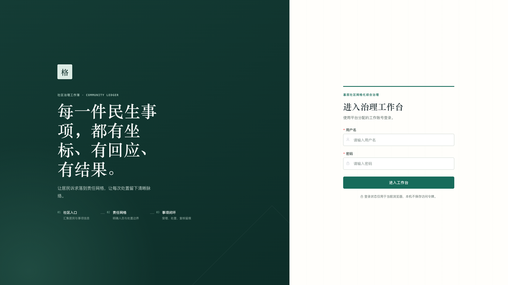
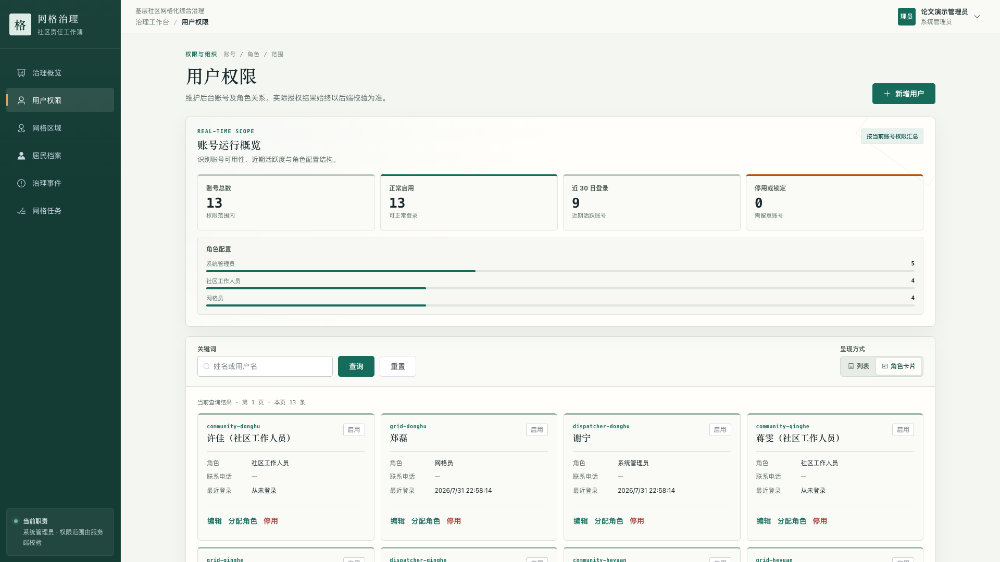
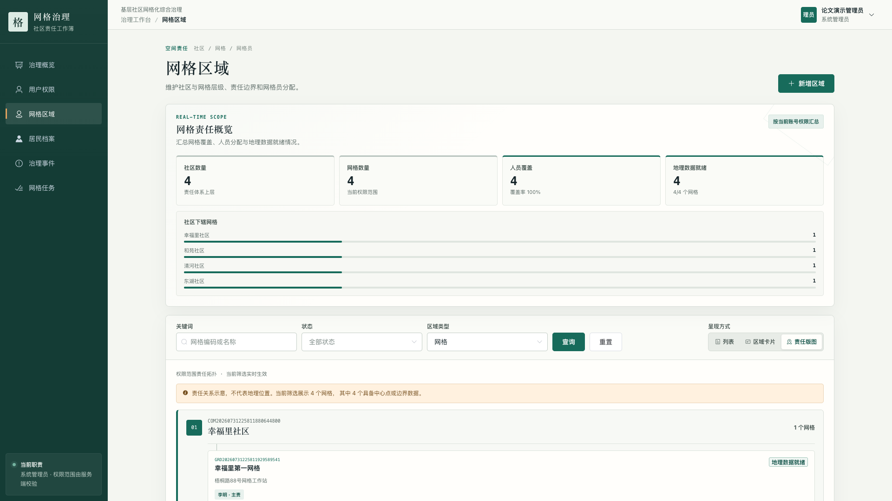
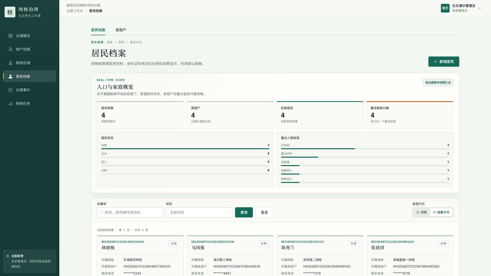
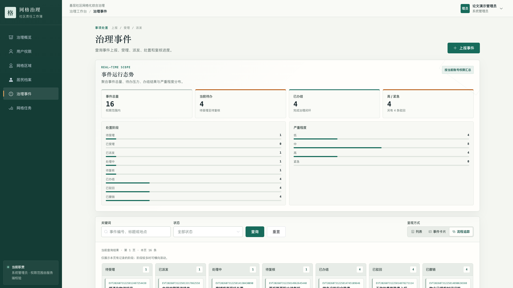
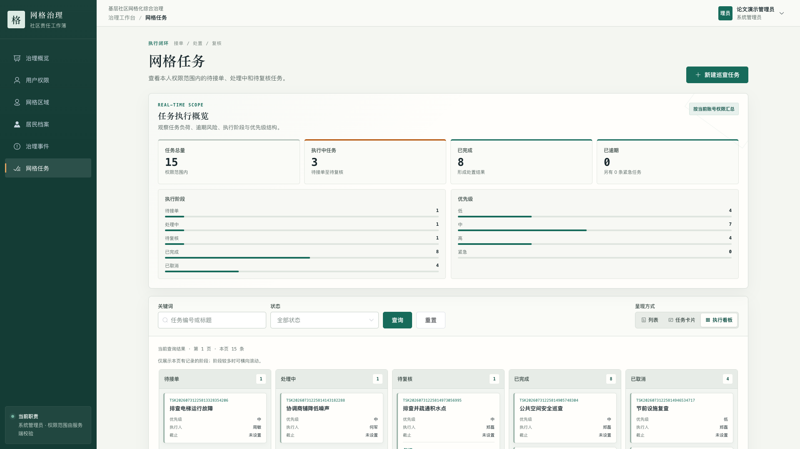
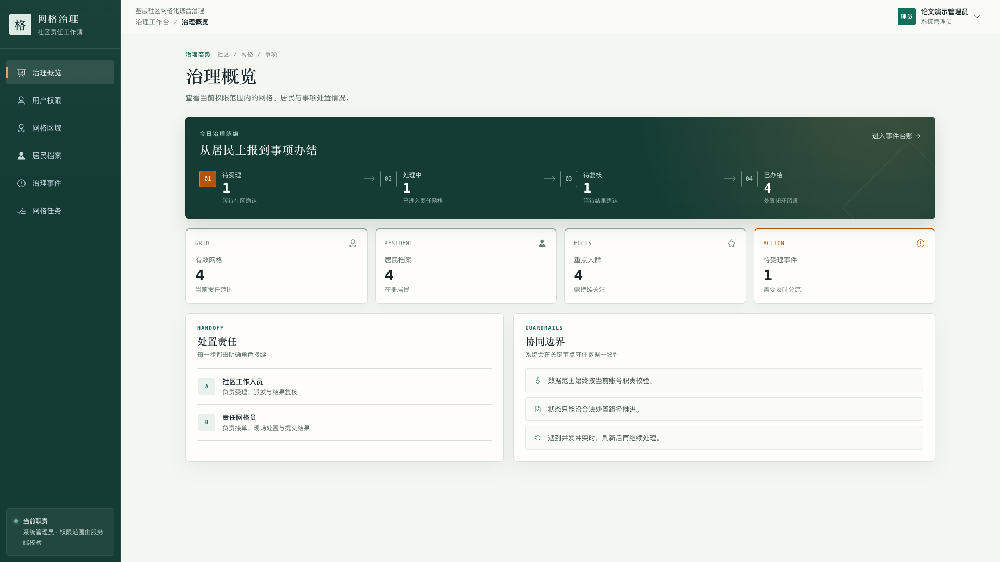
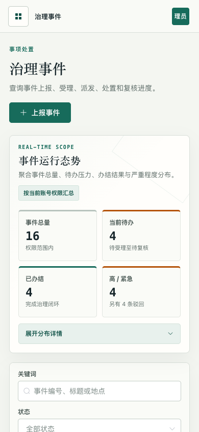

# 第5章 系统实现

> 使用说明：本稿按“第5章系统实现、第6章系统测试”编排。复制到学校论文模板时，可根据全文目录统一调整章节号、字体、行距和图表编号。测试结论应以本次隔离流水线生成的构建、API 和浏览器报告为准，不以固定历史数字替代实际运行结果。

## 5.1 系统实现概述

基层社区网格化综合治理信息平台围绕“社区—网格—居民—事件—任务”主线展开。系统将分散的居民档案、责任网格、事件上报和任务处置统一到一条可追踪的业务链中，使社区工作人员能够明确事件发生位置、责任人员和当前处置阶段，也使复核人员能够依据完整流转记录判断事件是否满足办结条件。

系统采用前后端分离架构。前端使用 Vue 2.7.16、Vue Router、Vuex、Axios 和 Element UI 构建管理端页面；后端使用 Java 17、Spring Boot 4.1.0 和 MyBatis 实现业务接口；MySQL 8 负责持久化数据，Flyway 负责数据库结构的版本化迁移。前端通过统一的 `/api` 前缀访问后端，后端按照 Controller、Service 和 Mapper 分层处理请求。Controller 负责参数接收和权限入口，Service 负责业务规则、状态迁移和事务控制，Mapper 负责数据查询与更新，从而避免在页面或控制器中分散核心业务规则。

系统首版使用系统管理员、社区工作人员、网格员和居民四类固定角色，并按多账号协作完成业务闭环。系统管理员负责用户、角色、菜单、事件类别和全局数据管理；社区工作人员负责网格、居民、事件受理、任务派发和结果复核；网格员在本人责任范围内接单并提交处置结果；居民只能查看本人档案、维护允许修改的地址和新手机号，并操作本人上报事项。权限判断不只依靠前端菜单显隐，后端还会依据角色、操作权限和责任区域再次校验数据范围。

## 5.2 身份认证与权限控制实现

系统采用服务端 Session 保存登录状态，用户密码使用 BCrypt 单向散列后入库。前端不在 `localStorage` 或 `sessionStorage` 中保存认证令牌，降低令牌被前端脚本直接读取的风险。登录前，浏览器首先请求 CSRF 信息；登录成功后，服务端轮换会话并刷新 CSRF Cookie。后续新增、修改和状态操作均需携带正确的 CSRF 请求头。

后端将角色与细粒度操作权限分开管理。例如，用户管理使用 `system:user:manage` 权限，事件受理、派发分别使用 `event:accept` 和 `event:assign` 权限，任务接单、处置与复核分别使用 `task:accept`、`task:handle` 和 `task:review` 权限。相同接口还会根据当前用户的社区或责任网格缩小可访问数据集合，前端传入的网格条件只能进一步缩小范围，不能扩大后端已经确定的权限边界。

*图5-1 系统登录界面*

图5-1展示了系统身份认证入口。页面以“每一件民生事项，都有坐标、有回应、有结果”为信息主线，帮助使用者在进入工作台前理解平台定位。登录成功后，前端请求 `/api/auth/navigation`，只依据服务端返回的启用且已授权 `MENU` 项生成菜单，并在本地已注册路由白名单中解析路径；首页按服务端菜单排序选择第一个可用路由。若服务端成功返回空菜单则进入无权页面，只有导航请求失败时才采用权限过滤后的本地静态兜底，静态配置不能补回未授权入口。

用户权限模块支持账号创建、资料编辑、角色分配、停用和重新启用。用户与角色关系采用可追踪的软失效方式：角色变更时结束旧关系，需要恢复时重新激活或新增有效关系，避免物理删除造成历史关系丢失。角色和菜单管理采用固定核心模型：四类角色码、菜单码、路由及权限码不可新增或改写，管理员只在预设职责边界内维护名称、说明、状态、排序和角色菜单关系。后端强制系统管理员保留系统管理权限、居民只保留本人服务台权限，并保护关键入口不被停用。

为避免权限变更后旧会话继续使用过期授权，账号记录保存安全版本，登录会话同时记录当时版本。账号状态、用户角色、角色权限或菜单状态变化时，服务端递增受影响账号的安全版本；安全过滤器在每次已认证请求中比较版本，不一致时立即清理认证、会话和 CSRF 状态并返回401。只改变名称、图标或排序等展示信息不会触发下线。事件类别管理权限仅属于系统管理员；附件删除和敏感审计查询即使拥有操作权限，仍要通过数据范围和业务状态校验。图5-2中的卡片视图同时展示账号状态、真实姓名、角色和最近登录时间，便于管理员识别账号是否可用以及当前承担的职责。

*图5-2 用户与角色管理*

## 5.3 社区与网格管理实现

网格区域模块采用社区和网格两级结构。社区作为上层治理单元，网格作为居民、事件和任务的直接归属单元。系统支持维护区域名称、地址、中心点和可选的 GeoJSON 边界数据，并为每个社区分配一个或多个社区工作人员、为每个网格分配一个或多个网格员，每个区域的有效分配中必须且只能有一个主负责人。

责任区分配采用历史保留机制。结束一项分配时记录结束时间，不覆盖原有记录；重新分配时创建新的有效关系。后端同时校验人员角色与区域类型：社区工作人员只能绑定社区，网格员只能绑定网格。停用区域前还会检查有效居民、未办结事件和进行中任务，防止区域停用后产生无人负责的数据。

*图5-3 网格空间地图*

图5-3在真实在线底图上呈现数据库中经纬度完整且有效的网格中心点。点选点位可查看所属社区、中心坐标、地址、状态及责任网格员；没有有效坐标的网格不会被放置到模拟位置，而是在同屏待定位清单中给出数量和补录入口。关键词、状态和区域类型筛选作用于完整权限范围内的空间数据，列表与区域卡片视图仍可独立使用。

## 5.4 居民与家庭户档案实现

居民档案模块以网格为必选归属，以家庭户为可选关联。创建或修改居民时，后端验证目标网格必须有效；选择家庭户时，居民与家庭户必须属于同一网格。居民迁出、死亡或归档均通过状态字段记录，系统不物理删除历史档案。

身份证号和手机号属于敏感信息。系统写入时使用 AES-256-GCM 加密，同时保存 SHA-256 哈希用于精确查重，并保存后四位用于脱敏展示。返回数据时，响应对象不包含密码散列、身份证密文和手机号密文等内部字段；没有敏感信息读取权限的账号只能看到脱敏结果。授权账号可通过 POST JSON 请求完成精确指纹检索，完整号码不会进入 URL，检索结果仍保持脱敏；需要查看明文时必须填写业务用途，服务端再次校验权限与数据范围，前端只临时展示60秒并在关闭时清空。检索和查看操作分别写入不含明文、密文或指纹的审计记录；系统管理员和社区工作人员还可按权限范围分页查询该审计元数据。受限账号只读取 `scope_grid_id` 落在当前范围内的历史记录，或本人产生的空范围记录，不用居民当前网格反推历史范围，避免居民迁网格后泄露旧审计记录。查询结果同样不返回敏感输入、密文、哈希或指纹。居民记录还支持独居老人、高龄老人、志愿者和重点关怀等标签，便于社区工作人员识别需要持续关注的服务对象。

*图5-4 居民档案卡片*

图5-4展示了居民与所属网格、家庭户及重点人群标签之间的关联。卡片中的手机号采用脱敏形式显示，在满足档案识别需要的同时减少敏感信息暴露。

## 5.5 治理事件与任务闭环实现

治理事件是平台业务闭环的起点。事件记录包括类别、发生网格、标题、描述、来源渠道、严重程度、地点和上报人等信息。事件类别由系统管理员动态维护，类别编码创建后不可改写，资料或启停更新携带 `version`；仍被非终结事件引用的类别不能停用，但已终结历史事件不会永久锁死类别。事件编号由后端统一生成，前端不能自定义主键或业务编号。事件状态依次覆盖待受理、已受理、已派发、处理中、待复核和已办结，同时保留已驳回与已撤销两个终止状态。

社区工作人员受理事件后，可选择责任网格员并派生处置任务。任务初始状态为待接单；网格员接单后，事件与任务同步进入处理中；提交处置结果后，两者同步进入待复核；复核通过时，事件进入已办结，任务进入已完成；复核退回时，两者回到处理中。事件状态、任务状态和对应流转记录在同一事务中更新，任一步骤失败都会整体回滚，避免出现事件已经办结而任务仍在处理的状态分裂。

系统在主记录上使用 `version` 字段实现乐观锁。所有状态动作必须携带客户端最后读取到的版本号，数据库更新也必须同时匹配记录编号与版本号。若其他工作人员已经先行处理，后提交的请求会被拒绝，提示使用者刷新后继续操作，从而防止并发处理时发生静默覆盖。

事件和任务均支持 JPEG、PNG 和 PDF 附件。前端先创建业务记录，再逐个上传附件；每次上传均携带绑定当前文件的稳定 UUID `requestToken`，后端将其作为同一业务对象下的幂等键，网络重试会返回原附件而不会新增记录。后端同时校验文件大小、声明 MIME 与二进制签名，计算 SHA-256，并用随机存储名写入配置化目录。附件列表、下载和删除都会重新校验当前用户对所属网格的访问范围，响应只暴露业务元数据和原始文件名，不暴露服务端存储路径。附件删除采用软删除并记录操作人和时间；事务提交后再清理物理文件，失败或进程中断留下的待清理项由后续扫描幂等重试。后台删除还校验上传人和业务状态。居民不拥有后台附件删除权限，只能在本人上报且仍为 `REPORTED` 的事件中通过居民服务台操作本人附件。任务附件以 `task_id` 建立正式归属，提交复核时每个 `attachmentId` 都必须属于当前任务，不能借用事件或其他任务附件。

系统将授权附件下载和关键管理请求写入通用操作审计表，保存操作人、时间、动作、业务对象路径、HTTP 状态和成功或失败结果。管理员审计页把该记录与事件、任务和敏感访问等既有流转统一展示，并支持按操作人、对象、时间范围和结果筛选；审计记录不保存请求体、敏感字段、会话令牌或附件内容。

*图5-5 治理事件流程追踪*

图5-5展示了事件在不同处置阶段的分布。演示数据特意保留待受理、已派发、处理中和待复核记录，并包含已办结、已驳回和已撤销样本，用于直观呈现完整状态机，而不是只展示全部办结的理想结果。

除事件派生任务外，社区工作人员还可以创建日常巡查等独立任务。独立任务同样经过待接单、处理中、待复核和已完成阶段；复核不通过时退回整改，尚未接单的独立任务可以取消。事件派生任务不能被单独取消，以免破坏事件与任务之间的一致性。

*图5-6 网格任务执行看板*

图5-6采用分栏看板展示各阶段任务。任务卡片提供任务编号、标题、优先级、执行人和期限等信息，工作人员可以在同一页面观察待接单、处理中、待复核、已完成和已取消任务的数量与分布。

## 5.6 治理概览与响应式页面实现

治理概览将分散在业务表中的数据转换为面向管理人员的统计信息，包括有效网格数、在册居民数、重点人群数，以及待受理、处理中、待复核和已办结事件数。其中“处理中”统一聚合已受理、已派发和处理中三种事件状态，避免工作尚未进入接单阶段时被统计遗漏。概览还返回按网格的事件总数、已完成有期限事件派生任务数、按期办结数和按期办结率；按期办结率的分母只包含存在期限且已经完成的事件派生任务，未完成逾期任务和无期限任务不进入分母。类别统计返回每类事件数量和 `0..100` 的百分数，最近事件按上报时间和编号倒序并限制为十条。统计查询沿用当前账号的数据范围，系统管理员查看全局数据，社区工作人员查看所属社区，网格员查看责任网格，避免统计结果泄露范围外信息。

*图5-7 社区治理概览*

图5-7中的处置路径把事件闭环概括为待受理、处理中、待复核和已办结四个管理阶段，下方卡片进一步显示网格、居民、重点人群和待办压力；网格办结情况、类别占比和最近事件共同解释统计数字的来源，使工作人员进入系统后即可识别当前工作重点。

系统管理端以桌面使用为主，同时针对窄屏设备调整导航、统计卡片、筛选表单和记录卡片的排列方式。移动端默认收起较长的分布详情，使用者可按需展开，减少首屏信息负担。

*图5-8 移动端治理事件页面*

图5-8为390×844视口下的事件页面。概览卡片按两列排列，筛选区域改为纵向布局，页面没有出现文档级横向溢出。该实现满足移动浏览器中的基本查询和进度查看需求，但首版不包含原生移动端应用。

## 5.7 本章小结

本章说明了系统各模块的实现方式。服务端会话、操作权限和责任区域共同限定访问范围；事件与任务状态机由事务和乐观锁约束，避免流转记录与主表状态不一致。治理概览、真实空间地图和响应式页面则负责把业务数据整理成工作人员可直接使用的信息。至此，从居民诉求进入系统到事件办结留痕的链路已经完整落地。

# 第6章 系统测试

## 6.1 测试目标与测试环境

系统测试验证系统管理员、社区工作人员、网格员和居民四类角色能否在各自权限范围内完成业务操作，验证事件与任务能否按照合法状态迁移，并检查桌面端和移动端页面能否正确呈现真实业务数据。为避免测试数据污染已有环境，所有集成验证均在临时创建的独立数据库中执行，测试结束后自动停止本轮前后端并删除本轮数据库。

表6-1列出了本轮验证使用的主要环境。

| 类别 | 工具或版本 | 用途 |
|---|---|---|
| 后端运行环境 | Java 17.0.9 | 编译、测试并运行 Spring Boot 应用 |
| 后端框架 | Spring Boot 4.1.0、MyBatis Starter 4.0.0 | 接口、权限、事务与数据访问 |
| 数据库 | MySQL 8.4.11、Flyway | 持久化及版本化迁移 |
| 前端运行环境 | Node.js 22.23.2 | 依赖复现、代码检查和生产构建 |
| 前端框架 | Vue 2.7.16、Element UI 2.15.14 | 管理端页面与交互 |
| 浏览器自动化 | Python 3.13、Playwright 1.61.0、Chrome/Chromium | 桌面端和移动端真实浏览器回归 |
| 测试数据库 | 随机名称的本机独立 MySQL 数据库 | 从零迁移、装载数据和完成业务闭环 |

## 6.2 测试数据设计

论文截图使用可重复装载的语义化演示数据。数据不来源于真实居民，而是围绕幸福里、和苑、清河和东湖4个虚构社区构造。表6-2给出了数据规模。

| 数据对象 | 数量 | 覆盖目的 |
|---|---:|---|
| 社区 | 4 | 验证社区—网格两级结构 |
| 网格 | 4 | 验证责任网格及主负责人分配 |
| 家庭户 | 4 | 验证居民与家庭户同网格约束 |
| 居民 | 4 | 验证脱敏字段和重点人群标签 |
| 治理事件 | 16 | 覆盖处理中与各类终止状态 |
| 网格任务 | 15 | 覆盖事件派生任务与独立任务 |
| 后台账号 | 13 | 覆盖系统管理员、社区工作人员和网格员 |

为了避免只验证“顺利办结”路径，演示数据中分别保留1条待受理事件、1条已派发事件、1条处理中事件和1条待复核事件；其余样本覆盖已办结、已驳回和已撤销。任务数据同样保留待接单、处理中和待复核状态，并包含已完成与已取消任务。

## 6.3 单元测试

后端单元测试重点覆盖状态机、网格业务约束、居民敏感数据处理、请求参数校验、用户生命周期、看板统计口径、事件类别乐观锁和附件归属。测试由 Maven Surefire 执行，最终通过数以本次构建报告为准。

| 测试组 | 主要验证内容 |
|---|---|
| 状态与任务服务 | 事件/任务合法迁移、复核退回、跨任务或已删除附件引用拒绝 |
| 网格与居民服务 | 责任区、网格依赖停用拒绝、敏感字段脱敏、审计范围与用途检索 |
| 看板与类别服务 | D2 聚合、D3 按期办结率、D4 类别百分比和最近事件、类别乐观锁与非终结引用保护 |
| 附件服务 | MIME/签名/散列、每个事件或任务第21个附件拒绝、上传者/状态/归属校验与软删除 |
| 认证与系统服务 | Session 即时失效、固定角色、动态导航、参数边界和注册隐私 |

单元测试验证业务层规则，但不能替代真实 MySQL 迁移、CORS 与浏览器交互，因此后续继续执行 API 与端到端测试。

## 6.4 API业务闭环测试

API测试在全新数据库上启动最终可执行JAR，由系统随机生成并隔离管理员、派发人员、社区工作人员、网格员和居民账号。验证覆盖四类角色多账号闭环、动态导航、类别管理、附件、敏感访问审计、看板统计与事件任务主流程。表6-4列出关键测试用例。

| 编号 | 测试场景 | 操作与预期结果 |
|---|---|---|
| API-01 | 登录、CSRF 与动态导航 | 角色登录后只返回当前启用且授权的 `MENU`；根路由落到首个可用菜单 |
| API-02 | 类别管理 | 创建默认启用、更新、陈旧 `version` 冲突；非终结事件引用时不能停用 |
| API-03 | 数据范围 | 范围外网格员访问任务返回403；看板和审计查询仅返回责任范围数据 |
| API-04 | 事件与任务闭环 | 上报、受理、派发、接单、提交复核、复核办结；驳回、撤销、退回整改和取消保留流转记录 |
| API-05 | 附件幂等与归属 | 事件/任务/居民附件上传、列表、下载、软删除；同一 `requestToken` 重试不新增记录；跨任务、已删除或终态附件被拒绝 |
| API-06 | 居民附件边界 | 居民仅能访问并删除本人 `REPORTED` 事件的本人附件，不能借同网格读取他人附件 |
| API-07 | 敏感访问审计 | 响应 `no-store`；用途关键字可检索；审计 DTO 无明文、密文或哈希；受限账号不可读取他人空范围历史记录 |
| API-08 | 看板统计 | D2 聚合 `ACCEPTED`、`ASSIGNED`、`PROCESSING`；D3/D4 百分比为 `0..100`，无分母为0，最近事件最多10条 |

运行时脚本在结束时输出事件、任务和账号样本标识；是否通过以及具体检查数量由本轮 `api-smoke.log` 决定。

## 6.5 浏览器端到端测试

浏览器端到端测试通过真实Chrome/Chromium内核访问本轮前端，分别以管理员和居民账号登录，检查服务端导航、首页解析、接口可读字段、页面筛选、多种呈现模式、附件下载和移动端布局。测试过程同时监听浏览器控制台错误、页面运行时异常、失败请求和状态码异常的API响应。主要场景见表6-5。

| 编号 | 页面或场景 | 验证内容 |
|---|---|---|
| UI-01 | 登录与根路由 | 管理员和居民登录后均按服务端导航解析首页 |
| UI-02 | 动态菜单 | 侧栏仅渲染服务端返回且在本地已注册的菜单；居民仅见服务台 |
| UI-03 | 治理概览 | D3 网格统计、D4 类别占比和最近事件字段与接口一致 |
| UI-04 | 事件历史 | 打开已办结事件的真实流转记录，确认受理、派发和复核动作可见 |
| UI-05 | 事件与任务附件 | 按编号定位记录、打开附件列表、核对文件名并触发授权下载 |
| UI-06 | 居民附件 | 居民服务台只显示本人事项附件，并通过嵌套接口下载 |
| UI-07 | 地图、卡片与移动端 | 真实坐标、可读字段、零值条和窄屏无横向溢出 |
| UI-08 | 敏感字段与审计页面 | 用途必填、临时显示和关闭清空；精确检索结果保持脱敏；审计弹窗可查询刚写入的用途且不显示完整身份证号或手机号 |

浏览器报告记录控制台错误、页面错误、失败请求和异常 API 响应；是否全部为0由本轮 `browser-e2e.log` 决定。论文图片生成流程仍可在隔离数据库中重复生成桌面和移动端截图。

## 6.6 构建与隔离清理验证

项目提供平台无关的自动验证流水线。流水线依次执行静态结构校验、后端测试与JAR打包、前端依赖复现、代码检查和生产构建，然后创建随机命名的隔离数据库，在随机本地端口启动本轮前后端，执行API与浏览器测试。无论成功、断言失败还是收到中断信号，脚本都只停止本轮记录的进程，并删除名称通过安全前缀校验的本轮数据库。

本轮流水线的验收条件如下：

- 静态校验识别 V1 至 V7 迁移、17张业务表、28个权限码、新接口、页面和测试资产；
- Maven 测试与可执行 JAR 打包成功；
- 前端依赖可由锁文件复现，代码检查和生产构建成功；
- 真实 MySQL API 冒烟与管理员/居民浏览器回归均成功；
- 测试结束后，只清理安全前缀匹配的本轮数据库和本轮进程，不影响原有开发服务。

## 6.7 测试结论与局限

当上述流水线通过时，可证明平台在该隔离环境和测试数据下完成了毕业设计首版的核心闭环：四类固定角色可在授权范围内操作；权限变化后旧会话立即失效；社区、网格、两级责任人员、家庭户和居民档案可建立正确关联；事件可完成受理、派发、接单、处置、复核和办结；异常分支、动态导航、附件约束、敏感访问审计和看板统计都有对应验证证据。

本轮测试有明确边界。浏览器回归以Chrome/Chromium为主，尚未覆盖Safari和Firefox；测试重点是功能正确性、状态一致性和页面可用性，没有执行大规模并发压测、长时间稳定性测试或专业渗透测试。附件幂等和乐观锁验证覆盖常见冲突，但不替代生产环境下的高并发容量证明。因此，本文结论仅适用于当前隔离环境和测试规模，不能作为生产环境容量或安全等级证明。

## 6.8 本章小结

本章记录了测试环境、演示数据和三层验证资产。固定角色菜单、权限变更会话失效、两级责任分配、居民敏感信息临时查看与审计、正常办结和异常分支均有对应样本；事件、任务和居民附件，动态事件类别、看板统计与注册隐私路径也纳入验证。按首版验收范围，系统可支撑基层社区网格化治理的核心业务演示；跨浏览器兼容性和生产级容量仍需后续验证。
